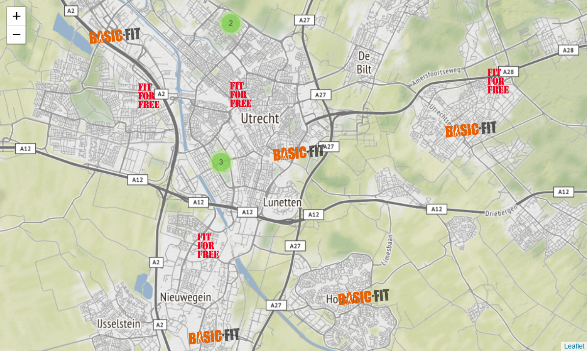

# Plotting gym locations on a map

Comparing the geographic distribution of gym locations of two large companies in The Netherlands ([Basic-Fit](https://www.basic-fit.com) and [Fit For Free](https://www.fitforfree.nl)) by plotting them on a map.

For the interactive plot, click [here](https://nbviewer.jupyter.org/github/Brinkhuis/Gym/blob/master/notebook/data_visualization.ipynb).

