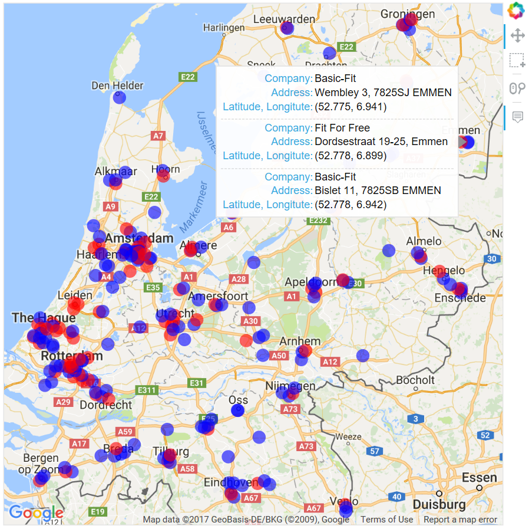

# Plotting Gym Locations on Google Maps

Comparing the geographic distribution of gym locations of two large fitness companies in The Netherlands ([Basic-Fit](https://www.basic-fit.com) and [Fit For Free](https://www.fitforfree.nl)) by plotting them on Google Maps.

For the interactive plot, click [here](http://htmlpreview.github.com/?https://github.com/Brinkhuis/Gym/blob/master/plots/gym.html).

